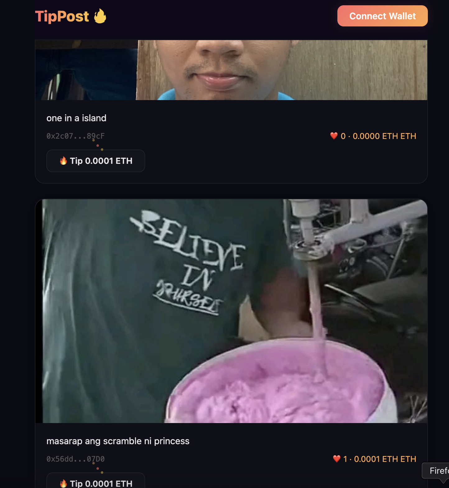

# TipPost — Web3 dApp

A pay-to-like social platform on Ethereum (Sepolia testnet). Post images with captions; tip creators 0.0001 ETH per like.

## Live Demo

- **Live URL**: [tippost-web3-app.vercel.app](https://tippost-web3-app.vercel.app)
- **Sepolia Contract**: [`0x90Cd6Cb7464d8aF3E3d5f07ee063f1379d126BE8`](https://sepolia.etherscan.io/address/0x90Cd6Cb7464d8aF3E3d5f07ee063f1379d126BE8)

## Stack

- **Contract**: Solidity ^0.8.20, Hardhat + TypeScript
- **Frontend**: React + Vite + TypeScript, ethers.js v6
- **Wallet**: MetaMask
- **Network**: Sepolia testnet (chainId 11155111)
- **Hosting**: Vercel

## Features

- Connect MetaMask wallet with Sepolia network guard
- Create posts with image URL and caption (stored on-chain)
- Tip/like posts by sending 0.0001 ETH to the creator
- Cannot like your own post
- Cannot like the same post twice (enforced on-chain)
- Real-time updates via contract event listeners (PostCreated, PostLiked)
- View total ETH earned from tips
- Transaction status bar with Etherscan links

## Screenshots

### Feed View — Live URL with Posts


### MetaMask Connected on Sepolia


### Post Created with Image Visible on Feed


### Like Transaction Confirmed in MetaMask (0.0001 ETH)


### Like Count and Earnings Updated After Transaction


### Double-Like Attempt Blocked (Error Message)


### Hardhat Tests Passing


## Local Setup

### Prerequisites

- Node.js 18+
- MetaMask browser extension
- Sepolia ETH (free from faucets below)

### Contracts

```bash
cd contracts
npm install
npx hardhat compile
npx hardhat test
```

### Frontend

```bash
cd frontend
npm install
cp .env.example .env       # fill in VITE_CONTRACT_ADDRESS and VITE_CHAIN_ID
npm run dev                # http://localhost:5173
```

## Environment Variables

**`contracts/.env`** (never commit):
```
SEPOLIA_RPC_URL=
PRIVATE_KEY=
ETHERSCAN_API_KEY=
```

**`frontend/.env`** (never commit):
```
VITE_CONTRACT_ADDRESS=
VITE_CHAIN_ID=11155111
```

## Contract Functions

| Function | Description |
|----------|-------------|
| `createPost(imageUrl, caption)` | Create a new post on-chain |
| `likePost(id)` | Tip a post with 0.0001 ETH |
| `getAllPosts()` | Get all posts |
| `checkLiked(id, user)` | Check if user already tipped a post |
| `totalEarnedByUser(user)` | Get total ETH earned by a user |

## Events

| Event | Description |
|-------|-------------|
| `PostCreated(id, creator, imageUrl, caption)` | Emitted when a post is created |
| `PostLiked(id, liker, creator)` | Emitted when a post is tipped |

## Deploy Steps

### Deploy contract to Sepolia

```bash
cd contracts
cp .env.example .env          # fill in SEPOLIA_RPC_URL, PRIVATE_KEY, ETHERSCAN_API_KEY
npm install
npx hardhat compile
npx hardhat run scripts/deploy.ts --network sepolia
# Record the printed address -> paste into frontend/.env as VITE_CONTRACT_ADDRESS
npm run copy-abi              # copies ABI to frontend/src/abi/TipPost.json
```

### (Optional) Verify on Etherscan

```bash
npx hardhat verify --network sepolia <DEPLOYED_ADDRESS>
```

### Deploy frontend to Vercel

1. Push repo to GitHub
2. Import project on vercel.com
3. Set env vars: `VITE_CONTRACT_ADDRESS` and `VITE_CHAIN_ID=11155111`
4. Framework preset: **Vite** — deploy

## Sepolia ETH Faucets

- https://cloud.google.com/application/web3/faucet/ethereum/sepolia
- https://faucet.quicknode.com/ethereum/sepolia
- https://www.infura.io/faucet/sepolia

## Security

- Never commit `.env` files or private keys
- Use a dedicated dev wallet — never your main wallet
- `.env` files are listed in `.gitignore`
